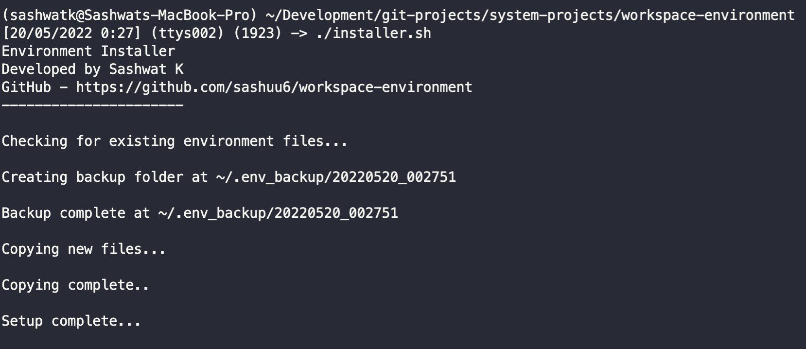

# workspace-environment

## Introduction

.cshrc, .login and .vimrc configurations

## Instructions

Run the following installer and restart your terminal.

`$ ./installer.sh`

## Screenshots

### Terminal

### Vim

