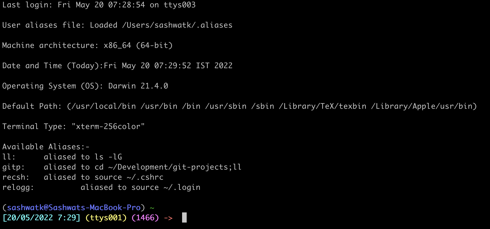
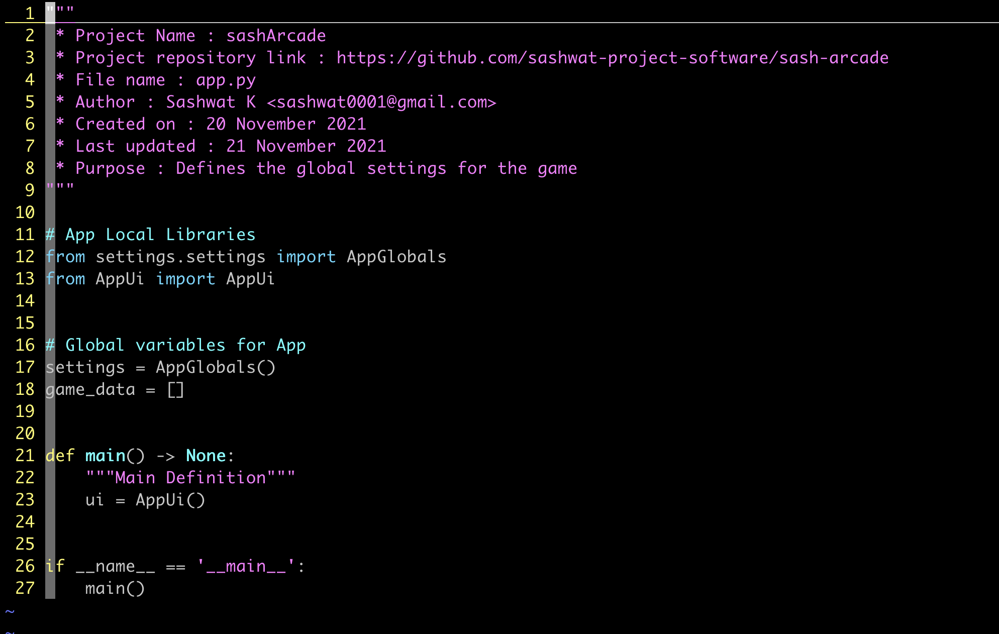

# workspace-environment

## Introduction

.cshrc, .login and .vimrc configurations

## Instructions

1. Symlink or copy the files to $HOME/
2. Restart the terminal

## Screenshots

### Terminal

### Vim

